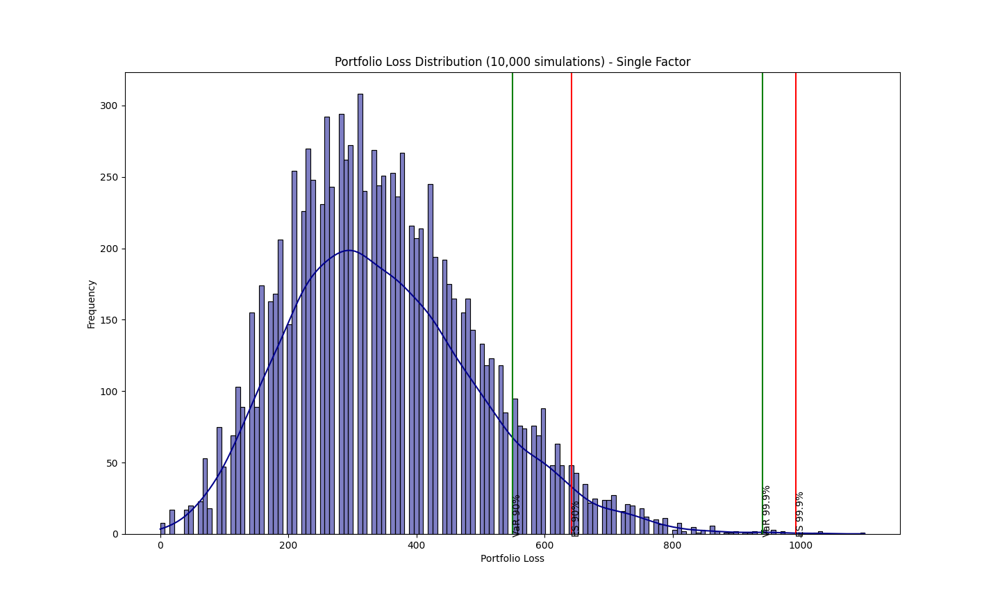
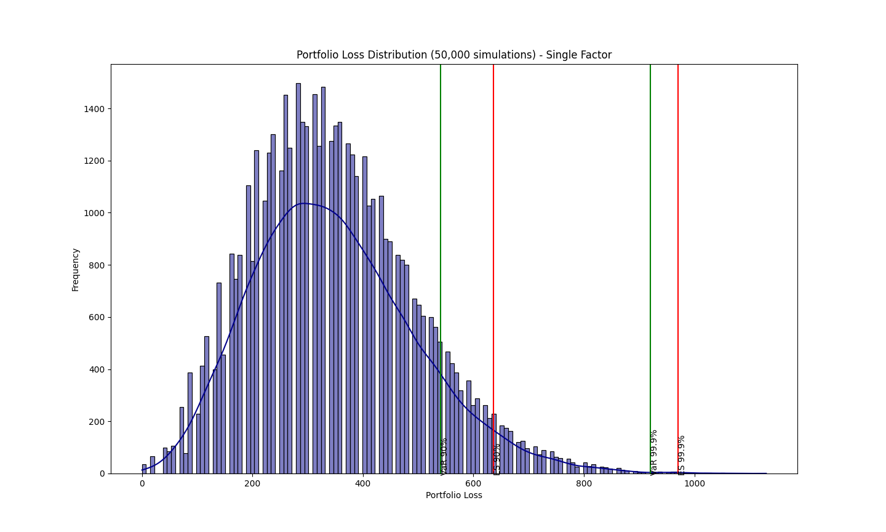
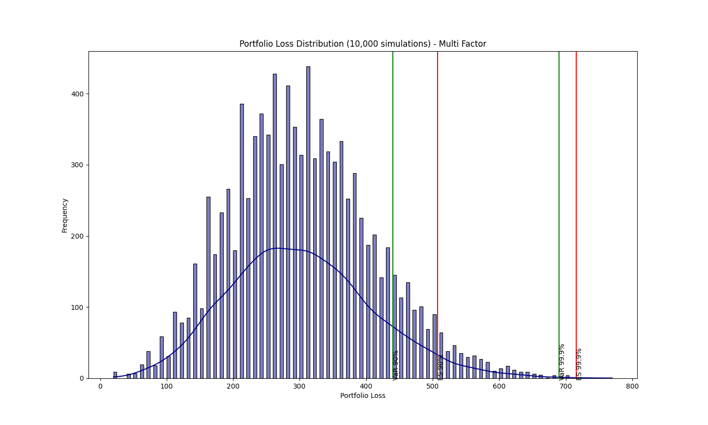
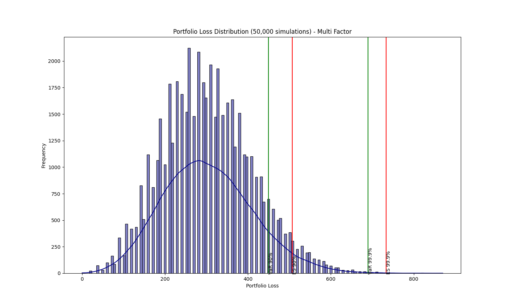

# portfolio-credit-risk
## Introduction
This repository models the single factor and multi factor credit risk portfolio distribution for commercial loans.
## Repository Structure
The repository is arranged in following directories:

* **code:** contains all the code for simulating both single and multi factor credit risk models.

    * **\_\_init.py\_\_:** this module creates classes and functions that will be used by other modules.
    * **single_factor_sensitivities.py:** this module calculates the systematic factor sensitivity for the single factor credit risk model. This is done using the following methods:
        1. Regression 
        2. Maximum Likelihood Estimation (MLE)
        3. Standard and Custom approach of calculating from Probabilty of Default (PD) of individual assets (as specified in Basel III)
    * **multi_factor_simulation.py:** this module generates the following -
       1. Portfolio loss based on the Single Factor Model;
       2. Plot of the portfolio loss distribution;
       3. Value-at-Risk (VaR) for 90% and 99.9% confidence intervals;
       4. Expected Shortfall(ES) for 90% and 99.9% confidence intervals.
    * **multi_factor_sensitivities.py:** this module calculates the systematic factor sensitivities for the multi factor model using Cholesky Decomposition followed by constrained multiple regression.
    * **multi_factor_simulation.py:** this module generates the following -
       1. Portfolio loss based on the Multi Factor Model;
       2. Plot of the portfolio loss distribution;
       3. Value-at-Risk (VaR) for 90% and 99.9% confidence intervals;
       4. Expected Shortfall(ES) for 90% and 99.9% confidence intervals.
* **data:** contains the data for portfolio equity returns and covariance matrix.

    * **database.db:** contains the portfolio data and the covariance matrix.
    * **sector_equity_returns.db:** contains the sector returns from _proxies_ for banking, consumer goods and real estate sectors.
* **export:** contains the output of both single and multi factor credit risk models.

    * **single_factor_sensitivities.csv:** contains the single factor sensitvities alongside PD, LGD and EAD data.
    * **multi_factor_sensitivities.csv:** contains the multi factor sensitvities alongside PD, LGD and EAD data.
    * **single_factor_PLD_100.png:** plots the single factor portfolio loss distribution for 100 simulations.
    * **single_factor_PLD_1000.png:** plots the single factor portfolio loss distribution for 1,000 simulations.
    * **single_factor_PLD_10000.png:** plots the single factor portfolio loss distribution for 10,000 simulations.
    * **single_factor_PLD_50000.png:** plots the single factor portfolio loss distribution for 50,000 simulations.
    * **multi_factor_PLD_100.png:** plots the multi factor portfolio loss distribution for 100 simulations.
    * **multi_factor_PLD_1000.png:** plots the multi factor portfolio loss distribution for 1,000 simulations.
    * **multi_factor_PLD_10000.png:** plots the multi factor portfolio loss distribution for 10,000 simulations.
    * **multi_factor_PLD_50000.png:** plots the multi factor portfolio loss distribution for 50,000 simulations.
## Outputs
Plots from the risk models (≥5,000 simulations):
### 
**Single factor portfolio loss distribution - 10,000 simulations**

**Single factor portfolio loss distribution - 50,000 simulations**

**Multi factor portfolio loss distribution - 10,000 simulations**

**Multi factor portfolio loss distribution - 50,000 simulations**

## Data Sources
* [Bank returns (26 Jan 2012 - 31 Dec 2019)](https://www.investing.com/indices/ftse-allshare-banks-historical-data)
* [Consumer goods returns (09 Jul 2012 - 31 Dec 2019)](https://uk.investing.com/indices/ftse-all-consumer-goods-historical-data)
* [Real estate returns (Mar 19, 2012 - 31 Dec 2019)](https://uk.investing.com/indices/ftse-allshare-re-invest.---service-historical-data)

**NOTE:** These are all proxy data to represent sector returns.
## References
* [An Explanatory Note on the Basel II IRB Risk Weight Functions](https://www.bis.org/bcbs/irbriskweight.htm)
* [Basel II: The First Pillar - Minimum Capital Requirements](https://www.bis.org/publ/bcbs128b.pdf)
* [Consolidating Multi-Factor Models of Systematic Risk with Regulatory Capital](https://www.math.kth.se/matstat/seminarier/reports/M-exjobb18/180601d.pdf)
* [Credit Risk Modeling using Excel and VBA](https://www.wiley.com/en-gb/Credit+Risk+Modeling+using+Excel+and+VBA%2C+2nd+Edition-p-9780470660928)
* [Modelling credit risk](https://www.bankofengland.co.uk/-/media/boe/files/ccbs/resources/modelling-credit-risk.pdf?la=en&hash=53B7332226FB2FB1B280B3D643DBB8AFF1FA5F32)
* [Quantifying Portfolio Credit Risk](https://www.ccruncher.net/ccruncher.pdf)
* [Quantitative Risk Management](https://press.princeton.edu/books/hardcover/9780691166278/quantitative-risk-management)
